## v2rayN 配置 - v2rayN 科学上网 2026 最新

科学上网软件 v2rayN 配置快速上手教程，v2rayN 是 Windows 平台下一款网络代理软件客户端，支持翻墙协议有Hysteria2, Shadowsocks (SS), Socks5, Socks5 Over TLS, Trojan, V2Ray, Xray等科学上网协议。

## v2rayN 配置教程

### 步骤一：复制节点订阅地址链接

一般机场服务商都会直接提供节点地址，包含各种格式，最常见的如Clash节点订阅地址、V2Ray节点订阅地址、Shadowrocket小火箭节点订阅地址等等，直接复制机场服务商提供的地址即可，如下图所示：

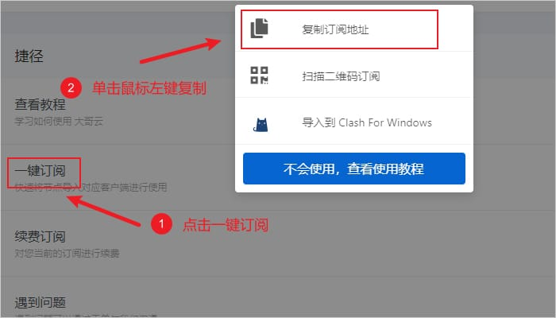

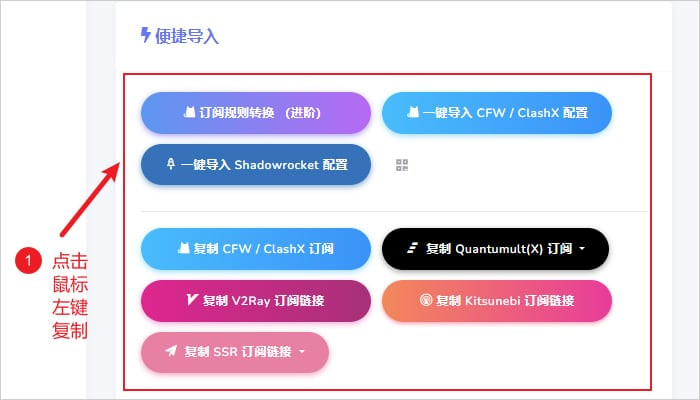

技术小白建议购买机场，无需搭建/编写配置文件，直接使用机场提供的节点订阅地址即可！

机场推荐：

- 【 [ORYMI（点击注册）](https://orymi.net/#/register?code=rDsEp8Hf)】 免费观看netflix、disney+、primevideo、hbomax 九折优惠码：LxwSsaay
- 【 [星辰加速（点击注册）](https://starlinkboost.com/#/register?code=9kfk8enH)】 150G/9元/月 解锁流媒体及ChatGPT等AI 九折优惠码：3UJuVnqS

### 步骤二：导入节点订阅地址链接

将复制的服务商提供的节点订阅地址直接粘贴到v2rayN中，点击软件主界面的`订阅分组`，`点击订阅分组设置`，如下图所示：

[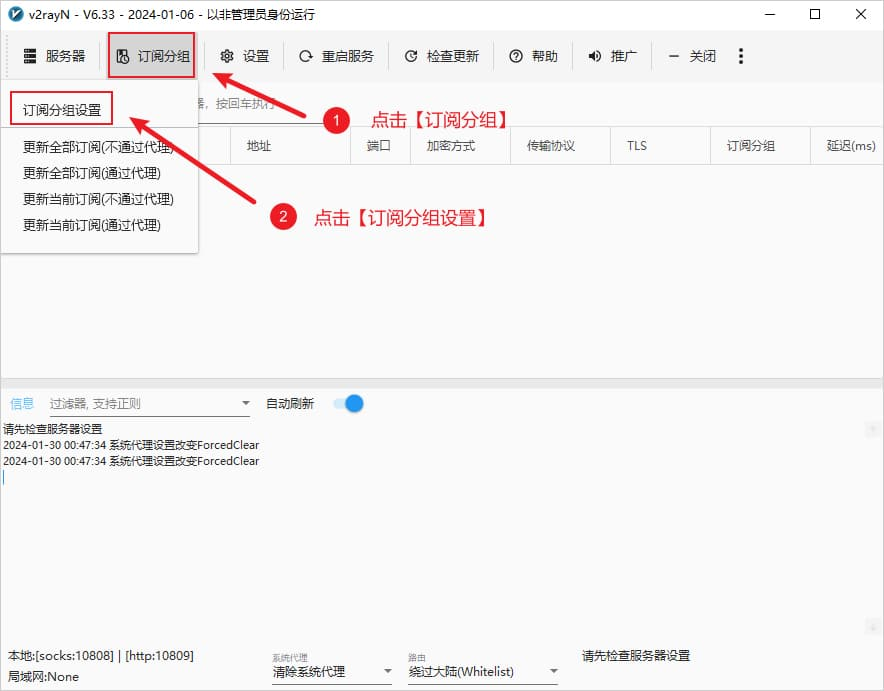](https://v2rayn.info/wp-content/uploads/2024/11/v2rayN-Subscription-Group.jpg)订阅分组

在弹出的窗口中点击添加，如下图所示：

[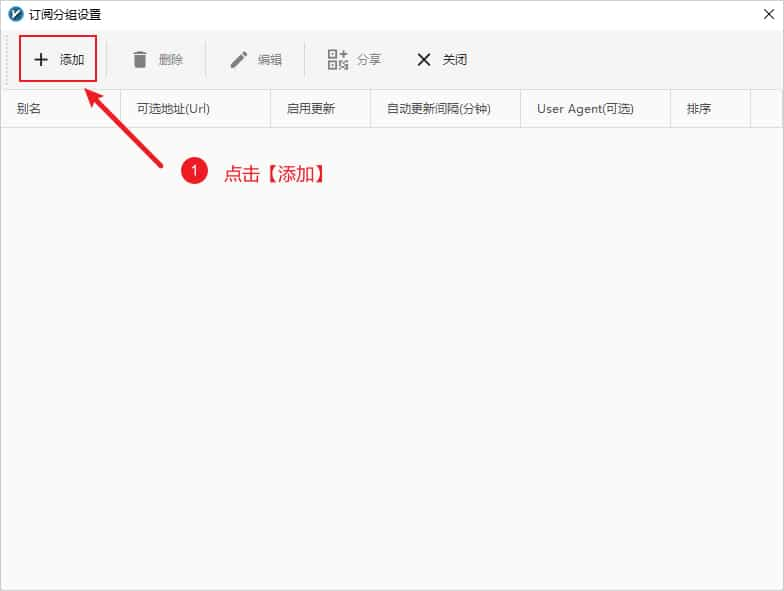](https://v2rayn.info/wp-content/uploads/2024/11/v2rayN-Subscription-Group-Settings.jpg)添加订阅分组

随后在弹窗的窗口中，输入别名，在`可选地址(Url)`部分粘贴订阅地址，点击添加，然后点击确定，如下图所示：

[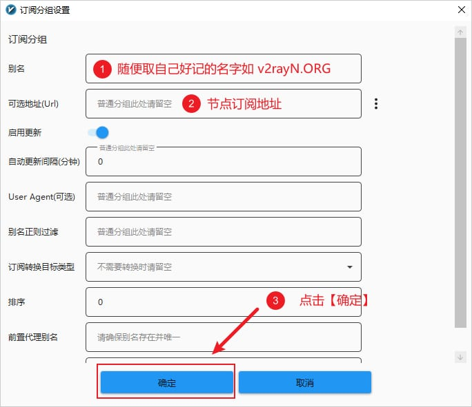](https://v2rayn.info/wp-content/uploads/2024/11/v2rayN-Subscription-Group-Settings-add-Subcription.jpg)订阅分组设置

添加完成后，点击软件主界面的`订阅分组`，然后点击更新全部订阅(不通过代理)即可成功使用订阅地址添加节点信息，如下图所示：

[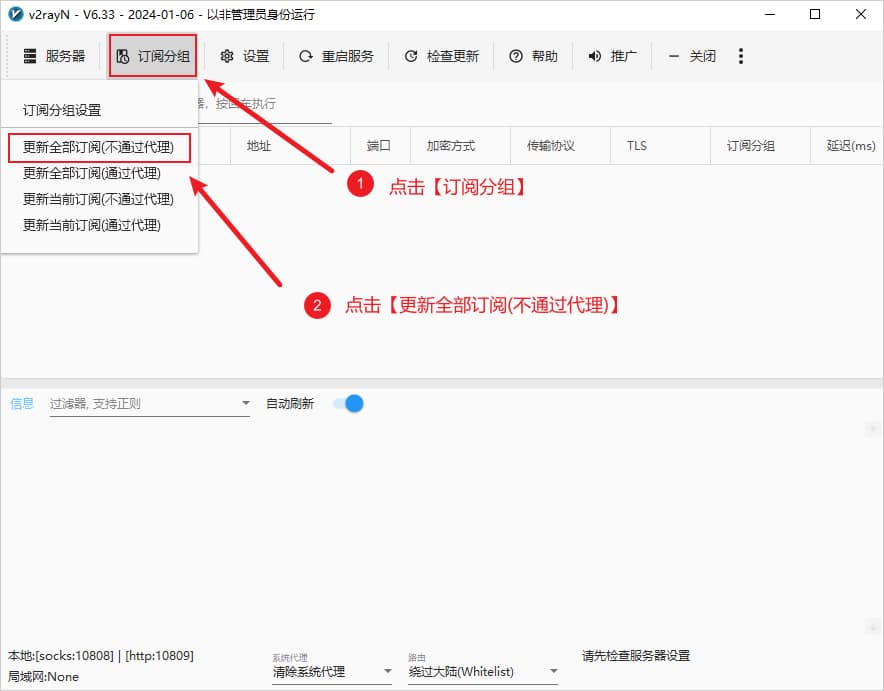](https://v2rayn.info/wp-content/uploads/2024/11/v2rayN-Subscription-Group-Update-Subscription-without-Proxy.jpg)更新全部订阅

### 步骤三：开启系统代理

#### 选择节点

在软件主界面选择任意节点，单击鼠标右键，在弹出的窗口中扎到设为活动服务器即可选择节点，如下图所示，然后开启系统代理即可，也可以选择任意节点，双击鼠标左键选择节点。

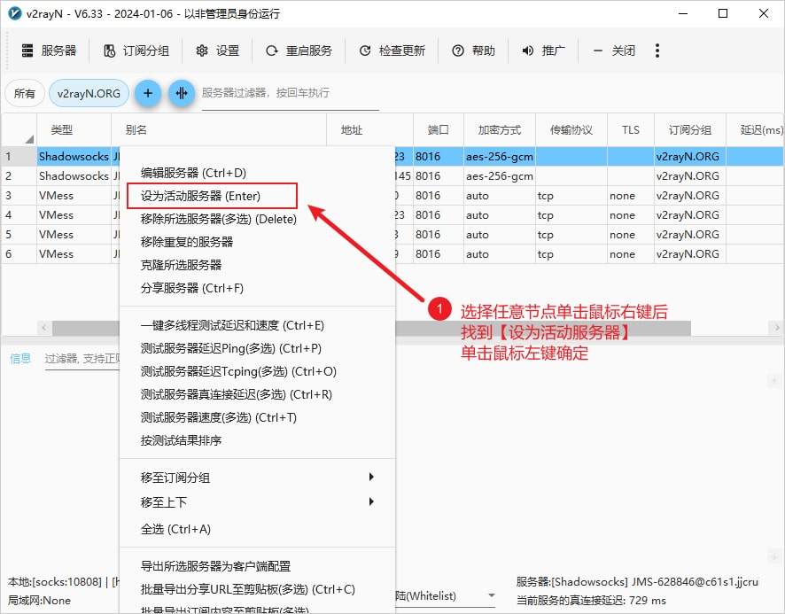选择节点

#### 系统代理

按照上面的配置教程配置完服务器（节点）后，需要设置系统代理才能让浏览器支持科学上网功能，在任务栏右下角系统托盘找到软件的图标，在图标上**单击鼠标右键**，点击**自动配置系统代理**，此时软件的图标会标称**红色**，至此就可以开始使用了，打开 [Google](https://www.google.com/) 试试能不能访问吧。

[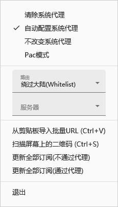](https://v2rayn.info/wp-content/uploads/2024/11/v2rayN-enable-System-Proxy.jpg)自动配置系统代理

#### 路由模式

路由的功能是将入站数据按需求由不同的出站连接发出，以达到按需代理的目的。这一功能的常见用法是分流国内外流量，可以通过内部机制判断不同地区的流量，然后将它们发送到不同的出站代理，有以下三种路由模式可以选择。

- 绕过大陆(Whitelist)模式：即原先版本里的白名单，只是白名单内的网站通过节点服务器代理上网
- 黑名单(Blacklist)模式：除了黑名单内的网站，其余网站都通过节点服务器代理上网
- 全局(Global)模式：所有网站通过节点服务器代理上网

根据不同的需求选择合适的路由模式，一般选择白名单模式。

[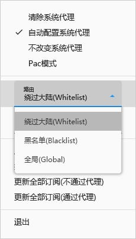](https://v2rayn.info/wp-content/uploads/2024/11/v2rayN-enable-Router-Mode.jpg)路由模式

#### 开机自动启动

在点击软件主界面的`设置`，点击`设置`然后点击`参数设置`进入参数设置页面，如下图所示：

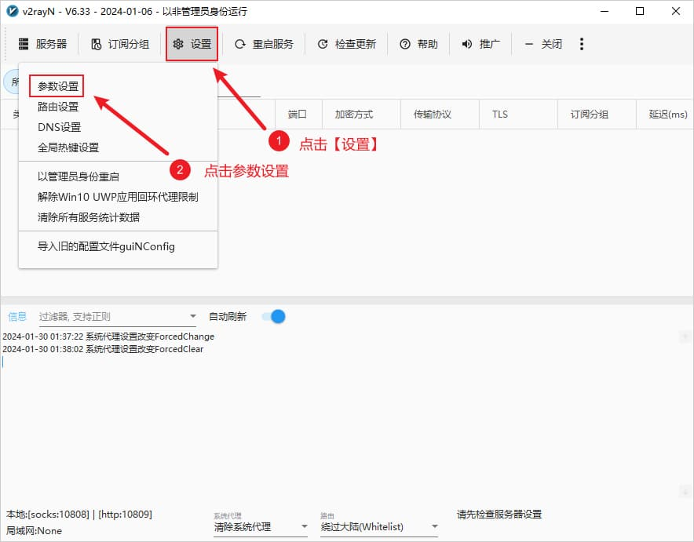参数设置

进入参数设置后，选择`v2rayN设置`标签页，勾选上开机自动启动复选框，然后点击确认，如下图所示。

[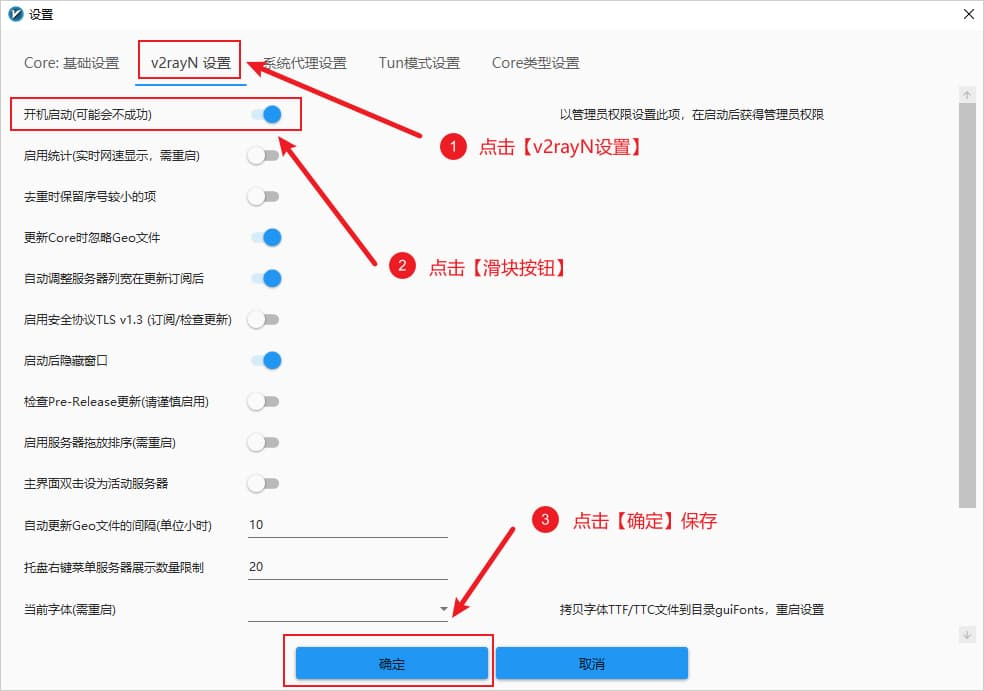](https://v2rayn.info/wp-content/uploads/2024/11/v2rayN-Settings-OptionSetting-v2rayN-Settings.jpg)设置开机自启动

开启系统代理后，打开浏览器，先打开一个无痕窗口（排除插件干扰）访问一下 Google 看能否正常访问。如果 Google 访问正常那说明代理配置没问题，至此就可以开始正式使用代理来进行上网了。