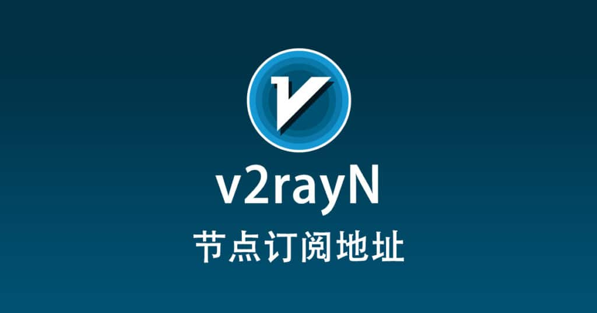

## v2rayN 节点好用的翻墙机场推荐 - v2rayN 科学上网

2026最新 v2rayN 节点分享好用的翻墙机场推荐，机场一般需要搭配第三方客户端，Windows、Mac、Android、iOS、Linux、OpenWRT 软路由上都有好用的科学上网软件，如 Windows 系统下的 v2rayN 等。

v2rayN 节点机场

## 机场推荐说明

- 机场运营 2 年及以上。
- 官网能在中国大陆访问，且支持支付宝或微信等国内常用的支付方式。
- 有较为活跃的用户群。
- 存在有效的工单处理通道。
- 不要经常掉线，或是订阅链接经常自动更换。

## 机场推荐汇总

### 高速机场推荐1:【 ORYMI 】

免费套餐 (抵扣码：FR666)

- 套餐流量：20 GB
- 带宽限制：5 Mbps
- 优质隧道专线
- 全平台客户端支持
- 同时在线设备：2 台
- 免费观看netflix、disney+、primevideo、hbomax

网站注册地址：【 [ORYMI（点击注册）](https://orymi.net/#/register?code=rDsEp8Hf)】 九折优惠码：LxwSsaay

注：跳转链接可能会 **被墙** ，如多次打开失败，请使用代理访问

### 高速机场推荐2：【星链加速】

轻量型 9元/月

- 流量：150 GB
- 速度限制：∞ Gbps
- 同时在线设备：不限制 台
- 流量按月重置
- 支持多平台使用
- 免账号观看disney+

网站地址：【[星辰加速（点击注册）](https://starlinkboost.com/#/register?code=9kfk8enH)】 九折优惠码：3UJuVnqS

注：跳转链接可能会 **被墙** ，如多次打开失败，请使用代理访问

## 机场客户端推荐

|                                                            |         |       |      |         |
| ---------------------------------------------------------- | ------- | ----- | ---- | ------- |
| 客户端                                                     | Windows | macOS | iOS  | Android |
| Clash for Android          |         |       |      | ✔       |
| Clash for Windows          | ✔       | ✔     |      |         |
| Clash Meta For Android |         |       |      | ✔       |
| Clash Mi                          | ✔       | ✔     | ✔    | ✔       |
| Clash Nyanpasu               | ✔       | ✔     |      |         |
| Clash Party                    | ✔       | ✔     |      |         |
| Clash Verge                     | ✔       | ✔     |      |         |
| Clash Verge Rev              | ✔       | ✔     |      |         |
| ClashN                           | ✔       |       |      |         |
| ClashX                              |         | ✔     |      |         |
| ClashX Meta                     |         | ✔     |      |         |
| ClashX Pro                       |         | ✔     |      |         |
| FlClash                         | ✔       | ✔     |      | ✔       |
| Hiddify                         | ✔       | ✔     | ✔    | ✔       |
| Loon                               |         |       | ✔    |         |
| Mihomo Party                  | ✔       | ✔     |      |         |
| NekoBox for Android      |         |       |      | ✔       |
| NekoRay                            | ✔       |       |      |         |
| OpenClash                        |         |       |      |         |
| PassWall2                        |         |       |      |         |
| Potatso Lite                       |         |       | ✔    |         |
| Quantumult                      |         |       | ✔    |         |
| Quantumult X                   |         | ✔     | ✔    |         |
| Shadowrocket               |         | ✔     | ✔    |         |
| ShadowsocksR Plus+                 |         |       |      |         |
| sing-box                          | ✔       | ✔     | ✔    | ✔       |
| Stash                             |         | ✔     | ✔    |         |
| Surfboard                     |         |       |      | ✔       |
| Surge                              |         |       | ✔    |         |
| v2rayN                              | ✔       | ✔     |      |         |
| v2rayNG                            |         |       |      | ✔       |
| V2rayU                              |         | ✔     |      |         |
| WinXray                            | ✔       |       |      |         |

以上推荐的 v2rayN 节点 都适合在 v2rayN 当中使用，只需要两个步骤即可开启代理科学上网翻墙，导入机场节点订阅地址，开启 v2rayN 系统代理即可。