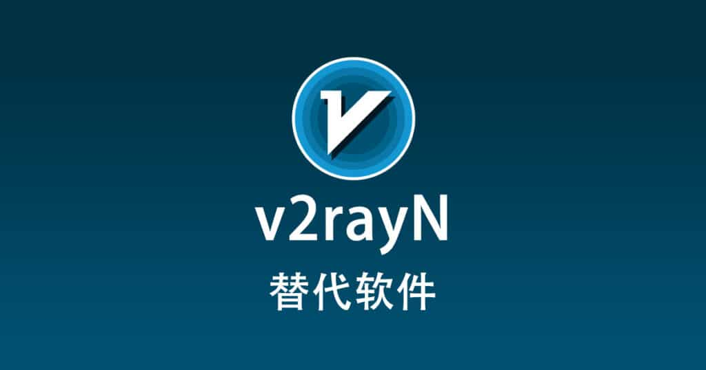

## v2rayN 替代软件有哪些？ - v2rayN 科学上网

v2rayN 替代软件有哪些？有哪些更好的 Windows 系统科学上网客户端推荐？除了 v2rayN 还有哪些翻墙软件、梯子工具推荐？

v2rayN是Windows平台、macOS平台、Linux平台多平台网络代理软件客户端，基于Xray及sing-box内核开发，内置在线订阅转换工具，支持翻墙协议有Hysteria2、Shadowsocks (SS)、Socks5、Socks5 Over TLS、Trojan、V2Ray、Xray等科学上网协议。除了 v2rayN 还有哪些免费翻墙客户端软件呢？以下是收集整理的替代方案。

目录

## v2rayN 替代方案

### Hiddify

Hiddify是基于基于 Sing-box 通用代理工具的跨平台代理客户端，Hiddify 提供了较全面的代理功能，例如自动选择节点、TUN 模式、使用远程配置文件等，支持翻墙协议有V2Ray、Xray、Reality、TUIC、Wireguard、Hysteria、SSH等科学上网协议。

### FlClash

FlClash是Windows、macOS、Linux、Android平台下一款网络代理软件客户端，基于Clash Meta开发，支持翻墙协议有Hysteria、V2Ray、Xray等科学上网协议。

### Clash Verge Rev

Clash Verge Rev是Windows、macOS、Linux平台下一款网络代理软件客户端，基于Mihomo内核开发，是Clash Verge之后的后续版本，支持翻墙协议有Shadowsocks (SS)、ShadowsocksR (SSR)、Trojan、V2Ray等科学上网协议。

### Clash Nyanpasu

Clash Nyanpasu是Windows、macOS、Linux平台下一款网络代理软件客户端，基于Mihomo内核开发，支持翻墙协议有Shadowsocks (SS)、ShadowsocksR (SSR)、Trojan、V2Ray等科学上网协议。

### sing-box

sing-box是Android、Apple TV、iOS、Linux、macOS、Windows平台下一款网络代理软件客户端，基于sing-box内核开发，支持翻墙协议有HHysteria、Shadowsocks (SS)、Trojan等科学上网协议。

### v2rayN

v2rayN是Windows平台、macOS平台、Linux平台多平台网络代理软件客户端，基于Xray及sing-box内核开发，内置在线订阅转换工具，支持翻墙协议有Hysteria2、Shadowsocks (SS)、Socks5、Socks5 Over TLS、Trojan、V2Ray、Xray等科学上网协议。

### Karing

Karing是基于singbox内核Android安卓手机、iOS苹果手机、macOS苹果电脑、Windows系统、Linux系统平台下一款多平台网络代理软件客户端，支持Clash订阅及V2Ray订阅一键导入使用，支持翻墙协议有Shadowsocks (SS)、ShadowsocksR (SSR)、Trojan、V2Ray等科学上网协议。

### Clash Party

Clash Party是基于Mihomo内核Windows系统、macOS系统苹果电脑、Linux系统平台下一款多平台网络代理软件客户端，支持翻墙协议有Shadowsocks (SS)、ShadowsocksR (SSR)、Trojan、V2Ray、Hysteria等科学上网协议。

### Clash Mi

Clash Mi是基于Mihomo内核Android安卓手机、iOS苹果手机、macOS苹果电脑、Windows系统、Linux系统平台下一款多平台网络代理软件客户端，支持翻墙协议有Shadowsocks (SS)、ShadowsocksR (SSR)、Trojan、V2Ray等科学上网协议。

### Mihomo Party

Mihomo Party是基于Clash Meta(mihomo)内核Windows系统、macOS系统苹果电脑、Linux系统平台下一款多平台网络代理软件客户端，支持翻墙协议有Shadowsocks (SS)、ShadowsocksR (SSR)、Trojan、V2Ray等科学上网协议。

### Qv2ray

Qv2ray是Windows、macOS、Linux平台下一款网络代理软件客户端，支持翻墙协议有HTTP、HTTPS、Shadowsocks (SS)、Socks5、V2Ray、Xray等科学上网协议。

### ClashN

ClashN是Windows平台下一款网络代理软件客户端，基于Clash内核开发，支持翻墙协议有Shadowsocks (SS)、ShadowsocksR (SSR)、Trojan、V2Ray、Xray、Socks5等科学上网协议。

### WinXray

WinXray是Windows平台下一款网络代理软件客户端，支持翻墙协议有HTTP、HTTPS、NaïveProxy、Shadowsocks (SS)、ShadowsocksR (SSR)、Socks5、Trojan、V2Ray、Xray等科学上网协议。

### NekoRay

NekoRay是Windows系统电脑及Linux系统电脑下一款网络代理软件客户端，基于V2Ray内核及sing-box内核开发，支持翻墙协议有HTTP、Hysteria、Hysteria2、NaïveProxy、Shadowsocks (SS)、Socks5、Trojan、TUIC、V2Ray、Xray等科学上网协议。

### Clash for Windows

Clash for Windows是Windows、macOS、Linux平台下一款网络代理软件客户端，基于Clash内核开发，支持翻墙协议有Shadowsocks (SS)、ShadowsocksR (SSR)、Trojan、V2Ray等科学上网协议。

### Clash Verge

Clash Verge是Windows、macOS、Linux平台下一款网络代理软件客户端，因为基于Tauri框架开发，支持完整的Clash配置以及部分支持Cash Premium配置，内置支持Clash Meta核心，支持自定义主题颜色，支持翻墙协议有Shadowsocks (SS)、ShadowsocksR (SSR)、Trojan、V2Ray等科学上网协议。

## 全平台客户端推荐

|                        |         |       |      |         |
| ---------------------- | ------- | ----- | ---- | ------- |
| 客户端                 | Windows | macOS | iOS  | Android |
| Clash for Android      |         |       |      | ✔       |
| Clash for Windows      | ✔       | ✔     |      |         |
| Clash Meta For Android |         |       |      | ✔       |
| Clash Mi               | ✔       | ✔     | ✔    | ✔       |
| Clash Nyanpasu         | ✔       | ✔     |      |         |
| Clash Party            | ✔       | ✔     |      |         |
| Clash Verge            | ✔       | ✔     |      |         |
| Clash Verge Rev        | ✔       | ✔     |      |         |
| ClashN                 | ✔       |       |      |         |
| ClashX                 |         | ✔     |      |         |
| ClashX Meta            |         | ✔     |      |         |
| ClashX Pro             |         | ✔     |      |         |
| FlClash                | ✔       | ✔     |      | ✔       |
| Hiddify                | ✔       | ✔     | ✔    | ✔       |
| Loon                   |         |       | ✔    |         |
| Mihomo Party           | ✔       | ✔     |      |         |
| NekoBox for Android    |         |       |      | ✔       |
| NekoRay                | ✔       |       |      |         |
| OpenClash              |         |       |      |         |
| PassWall2              |         |       |      |         |
| Potatso Lite           |         |       | ✔    |         |
| Quantumult             |         |       | ✔    |         |
| Quantumult X           |         | ✔     | ✔    |         |
| Shadowrocket           |         | ✔     | ✔    |         |
| ShadowsocksR Plus+     |         |       |      |         |
| sing-box               | ✔       | ✔     | ✔    | ✔       |
| Stash                  |         | ✔     | ✔    |         |
| Surfboard              |         |       |      | ✔       |
| Surge                  |         |       | ✔    |         |
| v2rayN                 | ✔       | ✔     |      |         |
| v2rayNG                |         |       |      | ✔       |
| V2rayU                 |         | ✔     |      |         |
| WinXray                | ✔       |       |      |         |
